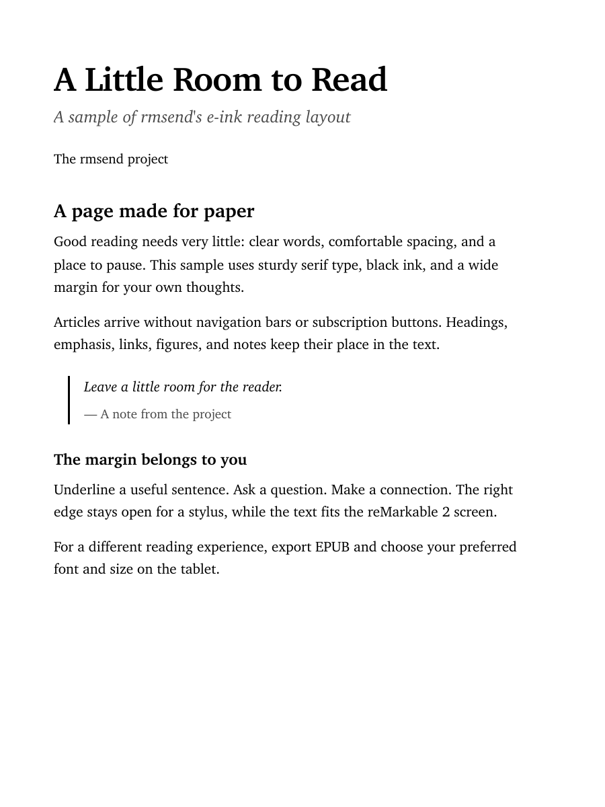

# rmsend

Send web articles and documents to your reMarkable, with a layout made for e-ink.
Local transfers over USB or SSH; no reMarkable cloud account, browser extension,
or AI service is needed.



```bash
rmsend 'https://example.org/an-article'
rmsend 'https://example.org/an-article' --format epub
rmsend notes.pdf book.epub newsletter.html
```

PDFs use black ink, sturdy serif type, comfortable line spacing, and a wide stylus
margin. EPUBs reflow using the tablet's font, size, and spacing settings. Existing
PDF and EPUB files pass through unchanged; local HTML brings its own stylesheet.

## Get started

The tested tablet is **reMarkable 2**. The default PDF dimensions fit its screen.
The conversion code runs on macOS and Linux; native Windows is not supported.
Other reMarkable models and firmware versions have not been tested. USB delivery
uses the tablet's web interface. SSH writes its document files directly and
restarts the tablet UI; save and close your current work before an SSH transfer.

1. Install [uv](https://docs.astral.sh/uv/getting-started/installation/) and
   [Google Chrome](https://www.google.com/chrome/) or Chromium. For EPUB output,
   install [pandoc](https://pandoc.org/installing.html) too. Python 3.11+ and the
   Python libraries are provisioned by uv when you run the script.
2. Clone and install the command:

   ```bash
   git clone https://github.com/ZoneMix/rmsend.git
   cd rmsend
   ./install.sh
   ```

   Keep the checkout in place and put `~/.local/bin` on your `PATH`. You can also
   run `./rmsend` from the checkout without installing it. The installer refuses
   to overwrite an existing command. Set `RMSEND_PREFIX` for another install path.
3. Connect a data-capable USB cable, wake the tablet, and enable its USB web
   interface in Settings → General settings → Storage. Verify that
   `http://10.11.99.1` opens on your computer.
4. Try the included sample:

   ```bash
   rmsend examples/sample.html
   ```

For wireless delivery, key-based SSH, custom hostnames, and troubleshooting,
follow [the device setup guide](docs/setup.md). If you only want converted files,
no tablet setup is necessary:

```bash
rmsend 'https://example.org/an-article' --dry-run --keep ./output
```

## Mere Orthodoxy / The Faith Received

The Faith Received reader loads its books through JavaScript. rmsend recognizes
reader URLs and exports their public data directly, retaining all sections or
book divisions without a browser or an AI extraction step:

```bash
rmsend 'https://mereorthodoxy.com/the-faith-received/read/?w=apostles-creed'
rmsend 'https://mereorthodoxy.com/the-faith-received/read/?w=keach-medium-betwixt-two-extremes' \
  --title 'A Medium Betwixt Two Extremes'
```

Classic single-file/sharded English works and EEBO books are supported. EEBO uses
the site's modernized spelling where provided; `--original` keeps the source
spelling. A modern sidecar's 404 means no modernization exists; other errors
stop the export. Navigation parameters such as `p` and fragments select a place
in the web reader: **rmsend exports the whole work**, not just that place.

TEI-only works and the PG, PLD, and PO corpora are not supported. rmsend reports
that limitation instead of sending a loading screen or silently omitting text.
See [the adapter contract and maintenance guide](docs/mere-orthodoxy.md).

Ordinary Mere Orthodoxy essays use the general article extractor. It only reads
content returned by the public URL and does not authenticate to member articles.

## Common options

```bash
rmsend article.pdf --transport ssh
rmsend article.pdf --transport web
rmsend article.pdf --folder Reading --create-folder
rmsend 'https://example.org/an-article' --title 'A shorter title'
rmsend article.pdf --no-restart
```

`--title` changes the library name; for URLs it also changes the printed title.
`--folder` selects SSH even when USB is connected. Folders are resolved by name;
`--create-folder` creates one if missing. Without it, a missing folder is an error.
`--no-restart` defers the SSH UI restart; new documents may remain invisible until
you run `ssh remarkable 'systemctl restart xochitl'`.

Multiple targets transfer together and pay for one UI restart. `--keep DIR` also
saves a local copy. `--dry-run` converts without contacting or changing a tablet.

Retention is optional and applies only when you explicitly pass `--keep-newest`.
It matches both the destination folder and title prefix. Use `--retention trash`
for recoverable pruning; `--retention rm` permanently removes matching documents
and their annotations. Never use a broad prefix for annotated books you want to keep.

```bash
rmsend issue.pdf --folder Newsletters --create-folder \
  --keep-newest 3 --title-prefix 'Weekly Newsletter' --retention trash
```

## Configuration and design

| Variable | Default | Purpose |
|---|---|---|
| `RMSEND_HOST` | `10.11.99.1` | USB web-interface address |
| `RMSEND_SSH_HOST` | `remarkable` | SSH config alias or `user@host` |
| `RMSEND_XOCHITL_DIR` | `/home/root/.local/share/remarkable/xochitl` | Tablet document directory |
| `RMSEND_ASSETS` | This checkout's `assets/` | Custom print/EPUB stylesheets |

[The design guide](docs/design.md) explains the screen dimensions, typography,
annotation margin, font fallbacks, and stylesheet customization. No font files,
device credentials, private keys, personal documents, or downloaded books are
included in this repository.

## Development

```bash
uv run --with-requirements requirements-dev.txt python -m unittest discover -s tests
uv run --with ruff==0.16.8 ruff check .
./rmsend examples/sample.html --dry-run --keep ./output
```

Tests are offline and never connect to a real tablet. CI runs them on macOS and
Linux. `rmsend.lock` locks the executable's Python dependencies; update with
`uv lock --script rmsend`. PDFs are not byte-for-byte reproducible across runs:
Chrome writes timestamps, and rendering depends on the installed browser/fonts.
The reader extraction is deterministic for the same input payloads and versions.

## License

Copyright © 2026 ZoneMix. Licensed under **GPL-3.0-only**; see [LICENSE](LICENSE).
Commercial redistribution is allowed under the GPL's conditions. Distributed
derivatives must preserve the GPL and provide the corresponding source as
required by the license. Dependencies keep their own licenses. Website texts
and illustrations retain their authors' rights; this project's license applies
to rmsend's code, styles, documentation, and original sample, not fetched works.

This is an independent project, unaffiliated with reMarkable or Mere Orthodoxy.
